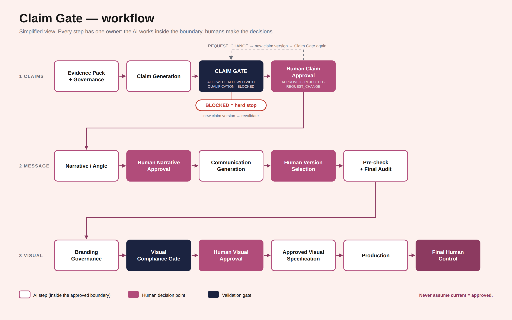

# Claim Gate

**An evidence-led governance architecture for AI-assisted marketing communication.**

Claim Gate lets a team use AI to produce marketing content at speed, without the AI quietly overstating what the evidence supports and without decisions that belong to people slipping to the model.

> The AI does not replace the workflow. It operates inside it.

---

## Why it exists

When AI writes marketing copy, three things tend to go wrong:

| Problem | What it looks like |
|---|---|
| **Claim drift** | A claim gets a little stronger with every rewrite ("matched the reference method" becomes "99% accurate"). |
| **Lost traceability** | Nobody can point from a sentence in the final banner back to the evidence behind it. |
| **Unclear responsibility** | Approvals get implied by the model instead of made by a person. |

These problems matter most in regulated fields such as medical diagnostics, where an unsupported claim is a compliance risk. That is why the test case for this project is medical diagnostics.

## What it is (and what it is not)

- **It is** a single, structured prompt architecture of 51 sections. It defines a workflow, what the AI may do at each stage, and where a human must decide.
- **It is not** software, an app, or a compliance tool. There is no custom interface. It runs inside a general-purpose AI chat (built and tested with ChatGPT and Claude), and it is enforced through instructions, not code.
- **It is not** legal or regulatory advice. Human review remains required.

## How it works

*Simplified view of the workflow. Purple steps are human decisions; outlined steps are performed by the AI inside the boundaries the architecture defines.*

### The Claim Gate has three verdicts

| Verdict | Meaning |
|---|---|
| **ALLOWED** | The evidence supports the claim. It is stated directly, without hedging. |
| **ALLOWED WITH QUALIFICATION** | The claim may proceed only with its limits attached (for example, "in lab testing"). |
| **BLOCKED** | Hard stop. A blocked claim cannot be repaired by softer wording, copywriting, visual design or human selection. If the claim must change materially, a new claim version is created and validated again. |

### Five human decision points

The AI can prepare options, analyze, recommend and generate. It cannot simulate, infer or assume approval. Humans decide at:

1. Claim approval
2. Narrative / angle approval
3. Version selection
4. Visual approval
5. Final control

### Three rules the whole system rests on

- **Current is not approved, and approved is not admissible.** The active version, the human-approved version and the version that passed the Claim Gate are tracked as separate things.
- **A + B does not automatically support "A caused B".** Every substantive element of a claim, and the relationship between elements, needs support.
- **Never make the communication stronger by making the evidence weaker.** Communication may be as persuasive as possible, but only inside the approved, evidence-supported meaning.

Confidence and scope are also treated separately: a fully supported claim must be stated with confidence, and needless hedging is treated as a defect, just like overstatement.

## Example

All names, brands and data below are fictional.

Evidence: internal lab report `LR-2025-014` for a fictional analyzer, "LumiCheck" (238 of 240 samples matched the reference method).

| Claim | Evidence | Approved by | Verdict | Why |
|---|---|---|---|---|
| LumiCheck showed 99% agreement with the reference method in lab testing (238/240 samples). | LR-2025-014 | Kate Wright (fictional) | Allowed | Supported by the evidence and clearly bounded to lab testing. |
| LumiCheck showed 99% agreement with the reference method. | LR-2025-014 | Kate Wright (fictional) | Allowed with qualification | Supported, but the claim needs its limitation attached ("in lab testing"). |
| LumiCheck is 99% accurate. | LR-2025-014 | n/a | **Blocked** | "Accurate" goes beyond agreement with a reference method. It extends the claim past the evidence boundary. |

## Status

Claim Gate is a **self-initiated prototype (v1.2)**, my first LLM architecture experiment. It is in a real-world pilot state: the architecture is frozen, and changes are made only in response to concrete failures observed in use.

Known limits:

- Enforcement relies on the model following instructions, so it can fail. That is why human decision points are part of the design.
- Systematic reliability testing (including attempts to push blocked claims through) is the next step.
- It has not been evaluated by regulatory or legal professionals.

## What is in this repository

- `README.md`: this overview
- `claim-gate-flowchart.png`: the workflow diagram
- `LICENSE`: terms of use

The full prompt is **not published** in this repository. If you would like to discuss the architecture in more detail, please get in touch.

## License

Copyright (c) 2026 Małgorzata Dukiet. **All rights reserved.** See [LICENSE](LICENSE). The content is published for viewing only; it may not be copied, modified, redistributed or used commercially without written permission.

## Author

**Małgorzata Dukiet**: art director, brand strategist, creative systems / AI workflow design.

Case study: [https://drive.google.com/file/d/1Wlo-GTUFVOyaBUsa26soB_hiDUUA4CO0/view?usp=drive]
